# Procesverslag

**Auteur:** Ufuk Argun

**De opdrachten:** [opdracht 1](opdracht1/index.html) en [opdracht 2](opdracht2/index.html)

## Bronnenlijst

1. [Youtube Tutorial: Learn CSS Animation In 15 Minutes](https://www.youtube.com/watch?v=YszONjKpgg4)
2. [Text Mirroren](https://www.w3docs.com/snippets/css/how-to-flip-text-with-css.html)
3. [Instant transition](https://stackoverflow.com/questions/45896706/css-transition-is-instant-and-not-fading-into-the-transition)
4. [Zoomen (niet gelukt)](https://stackoverflow.com/questions/61698727/zoom-into-object-until-it-passes-css-html)
5. [Shapes](https://sharkcoder.com/visual/shapes)
6. [Dark color scheme](https://developer.mozilla.org/en-US/docs/Web/CSS/@media/prefers-color-scheme)
7. [Pseudo elementen manipuleren](https://developer.mozilla.org/en-US/docs/Web/CSS/::before)
8. [Positioning](https://stackoverflow.com/questions/7720730/how-to-align-absolutely-positioned-element-to-center)

## Opdracht 1 plan

  
uitwerken na schetsen idee (voor week 2)

### Je storyboard:

  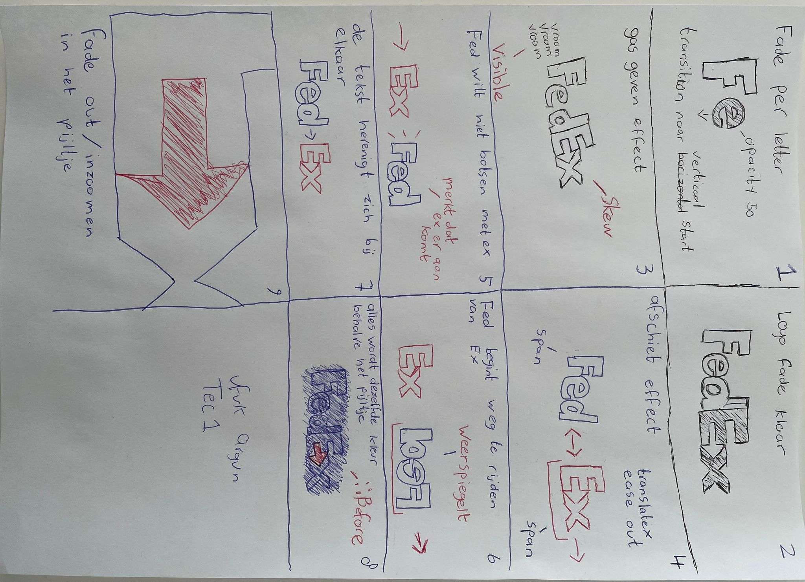

### Je ambitie:

Aan deze technieken/punten wil ik werken:

- Werken met pseudo elementen
- Ease in/outs beter leren gebruiken
- Manipuleren van losse letters
- Leren animeren :)

## Opdracht 1 tussentijdse feedback

[Link naar het miro board](https://miro.com/app/board/uXjVPw4ZF3E=/)

Feedback van Nicole (klasgenoot)

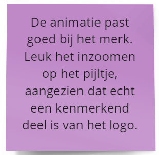

Mijn concept is goedgekeurd voor, omdat het past bij het merk. FedEx is het woordmerk dat ik heb gekozen om te gaan animeren.

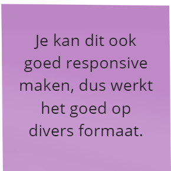

Mijn logo neemt eigenlijk volle breedte van het scherm in, hierdoor kan het eigenlijk gebruikt worden voor bijna alle formaten, omdat de animatie van het scherm afrolt. Er zou wel nog een knoop ontstaan in het timen van hoelang de animatie buiten het scherm blijft.

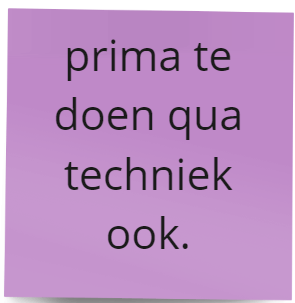

De techniek valt prima behalen. Ik moet goed gebruik maken van pseudo elementen zoals "::before of ::after".
Deze moet ik goed tussen het pijltje van FedEx stoppen zodat de outro animatie goed verloopt.
Verder moet er voor techniek goed gekeken worden naar de fonts die het FedEx pijltje kunnen weergeven.
Momenteel mix ik 2 fonts door elkaar waardoor het redelijk goed lijkt.

Dit is momenteel het probleem:

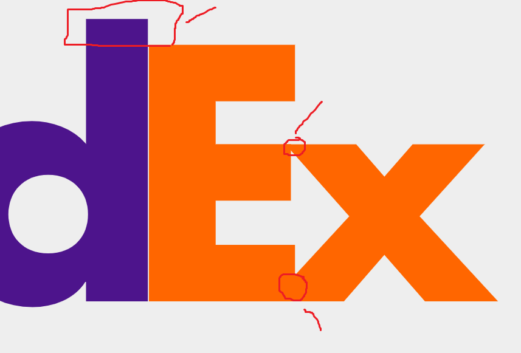

Ik kan het gewilde resultaat behalen door de letters in de span zelf te manipuleren en het researchen van een passende karakteristieke font.
De problemen zijn aangegeven met een rode cirkel/rechthoek zodat het duidelijk is waar we over praten.
De letter "d" die uitsteekt valt gefixt te worden door een pseudo element goed te plaatsen met "position: absolute;"

## Opdracht 1 reflectie

  
uitwerken bij afronden opdracht (voor week 4)

### Je uitkomst - karakteristiek screenshot(s):

  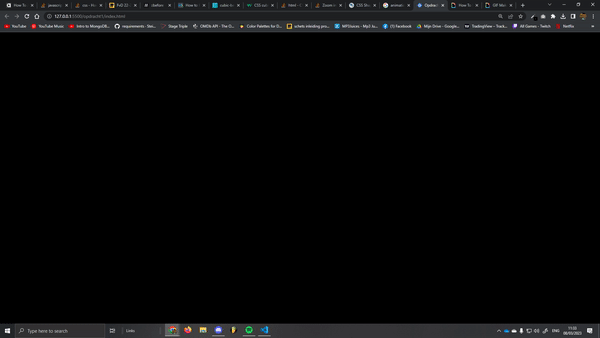

### Dit ging goed/Heb ik geleerd:

#### Maken van animaties en deze toepassen
Het maken en toepassen van meerdere animaties, met delays, achter elkaar.
Een animatie maken lijkt veel makkelijker dan dat het voor mijn gevoel was.
Ik heb ontzettend veel handmatig de spans moeten positioneren doordat ik position absolute gebruik en divs niet zijn toegestaan.
Hier onder ziet u bijvoorbeeld 3 verschillende animaties.

  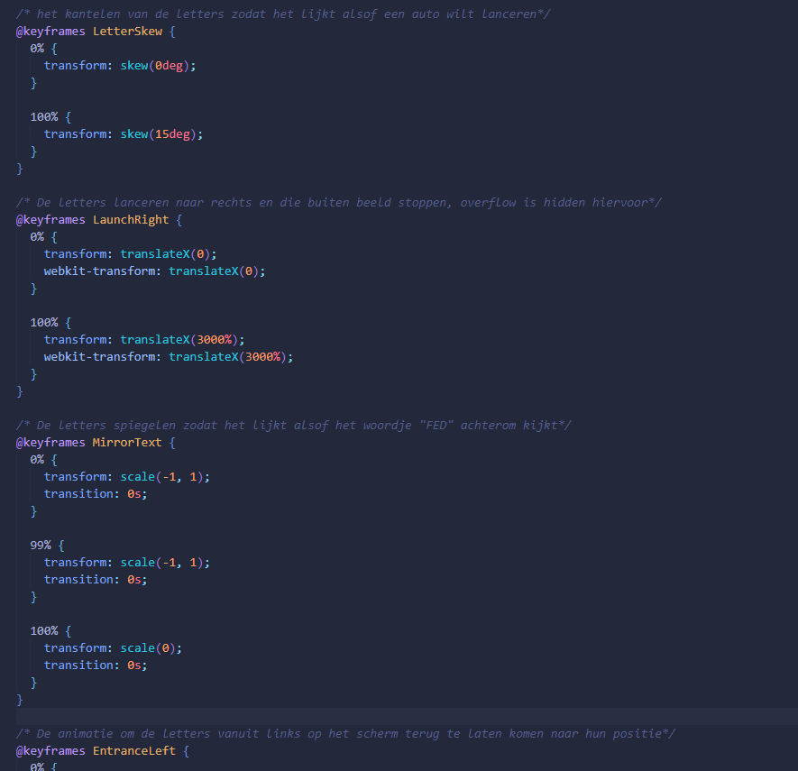

#### Manipuleren van pseudo elementen
Dit is een voorbeeld van hoe ik mijn pseudo elementen manipuleerde.

  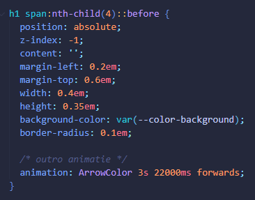

De logica hier achter is eigenlijk vrij simpel, we maken een ::Before, die we de grootte geven tussen de twee letters E en x.
de E en x laten we weg vagen door de kleur van de achtergrond toe te passen (zowel voor dark modus als light)
Hierdoor lijkt het alsof er een pijl ontstaat tussen de letters.
zoals je onderin kunt zien wordt het element ook geanimeerd.
Resultaat:

  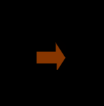

De tweede Pseudo element die ik gebruikte was weer een ::before,
maar dit keer manipuleerden we text er bij.
Zoals je kan zien in de afbeelding hier onder maken we de tekst "vroom" en roteren we de tekst een stukje.
Ook worden de font-instellingen veranderd.

  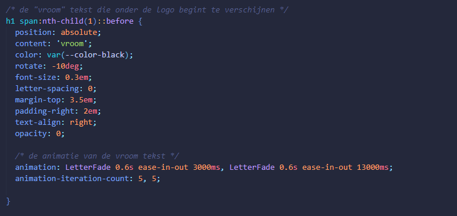

Dit is het resultaat er van:

  

#### Dark theme

Tijdens de les legde Sanne uit hoe we voor de web-browser thema aparte styling konden aangeven.
Dit heb ik toegepast op elementen zoals de achtergrond en de pseudo elementen.
Ik heb dit kunnen realiseren door op deze wijze te werken:

  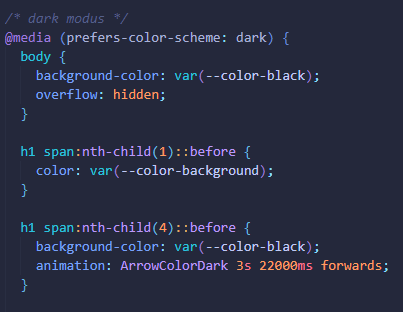

Door deze feature te implementeren in onze css hebben we nu onze eigen "themas", dit is bijvoorbeeld de dark modus:

  

en dit de light modus:

  

### Dit was lastig/Is niet gelukt:

Het behouden van de juiste posities van de letters na het toepassen van een animatie.
Ik heb geprobeerd te expirimenteren met forwards, backwards, both en none maar ik verloor uiteindelijk te veel haren en tijd dat ik het achter me heb gelaten.

  

Hier zit de F van Fed bijvoorbeeld te dichtbij de e nadat er skewing wordt aangeroepen in de animatie, nu zou je denken dat ik simpelweg none; zou kunnen gebruiken, maar de animatie blijft buiten beeld voor enkele secondes.

Dit was het idee:

  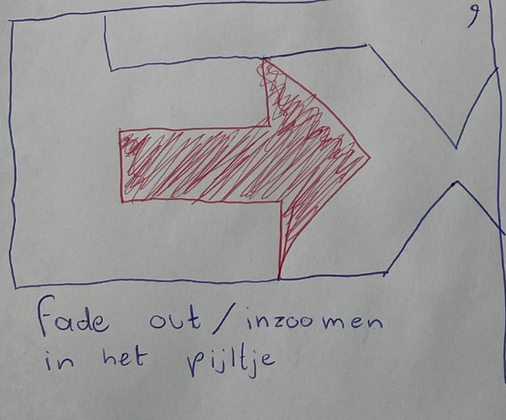

Maar echter kwam ik er achter dat het vrij complex is doordat ik per span een position absolute gebruik en geen divs kon gebruiken.
nu is de x van Ex een andere hoogte dan de rest, omdat het pijltje moet vormen en ik een representatieve font moest vinden hiervoor.
doordat de x een andere grootte is ontstaan er veel problemen, ook met het afschieten op beeld, deze gaat wat slomer omdat de letter kleiner is.
Ik heb geprobeerd scale te gebruiken maar geen success ;(

Ook werd het complex voor het pijltje, omdat deze richting het midden van het beeld moest, maar er te veel moeite was en handmatig werk om het ook nog responsief te houden.

Ik heb uiteindelijk een andere outro gekozen, namelijk dat het pijltje even opvalt en dan uitvaagt.

Ik kreeg hierna wat feedback van de docent en heb deze toegepast (clamp en kortere styling)

## Opdracht 2 plan

  
uitwerken na schetsen idee (voor week 5)

### Je ontwerp:

### Je ambitie:

Aan deze technieken/punten wil ik werken:

- Keydown events
- Input events
- Bingo systeem maken
- Styling kunnen geven aan JS gegenereerde elementen

## Opdracht 2 test

  
uitwerken na testen (week 7)

Neem minimaal 5 bevindingen op:

### Bevinding 1:

Voor de nieuwe bingonummer was onduidelijk welke het nieuwst was

#### oplossing:

Ik heb met een :before een highlight gegeven aan de nieuwste nummer in de nummers lijst

Dit is de code hiervoor:

daarnaast heb ik een animatie toegevoegd zodat de nieuwe gerollde nummer groot in het scherm kwam

Dit is de code hiervoor:

Samen met JS maak ik een element aan die ik deze class geef:

### Bevinding 2:

De gebruiker ziet niet altijd de bingo nummers die ze kunnen matchen

#### oplossing:

Door het gebruiken van micro-interaction hebben de matchbare bingonummers nu een kleine animatie:

Hier is het bingo getal 12 bijvoorbeeld beschikbaar.

door deze animatie:

### Bevinding 3:

de user kon in de input UI event ook letters als input geven, terwijl de gerollde nummers hier alleen inkomen

Dit heb ik gefixt door simpelweg in de html type="number" aan te geven

  

### Bevinding 4:

de gebruikers misten een micro interactie voor het matchen van nummers, hier onstond verwarring of de nummer gematcht was of niet

### oplossing:

We geven de animatie ook de property forwards, zodat de groene kleur blijft staan zodra de animatie is afgelopen

### Bevinding 5:

Sommige users waren slim genoeg om de bingo knop te klikken voordat het mogelijk was.

### oplossing:

Ik heb dit opgelost door een if else te gebruiken:

## Opdracht 2 reflectie

  
uitwerken bij afronden opdracht (voor week 8)

### Je uitkomst - karakteristiek screenshot(s):

  Dark-mode small screen
  
  
  Light mode medium screen
  

### Dit ging goed/Heb ik geleerd:

De CSS highlight is gemakkelijk te maken door het gebruik van juiste position: relative; op de li zelf

Keydown events, index gebruik en event listeners

Math.floor

Elementen inserten vanuit JavaScript

### Dit was lastig/Is niet gelukt:

Een apparte eindscherm die alles in de pagina verandert naar een eindscherm, ik heb nu zodra je bingo klikt een popup

Ik wilde de bingo knop een animatie geven zodra bingo mogelijk was, dit werd mij te complex met JavaScript

### Bronnen:

- [Event listener voor click](https://developer.mozilla.org/en-US/docs/Web/API/Element/click_event)
- [Push value naar een array](https://stackoverflow.com/questions/7261431/adding-items-to-an-object-through-the-push-method)
- [querySelector gebruik](https://developer.mozilla.org/en-US/docs/Web/API/Document/querySelector)
- [Math floor](https://www.tutorialspoint.com/math-floor-function-in-javascript#:~:text=floor()%20function%20in%20JavaScript,-HTMLJavascriptWeb&text=The%20floor()%20function%20of,this%20function%20returns%20the%20same.)
- [Loop voor li's](https://www.w3schools.com/js/js_loop_for.asp)
- [Classlist property](https://developer.mozilla.org/en-US/docs/Web/API/Element/classList)
- [Append child methode](https://developer.mozilla.org/en-US/docs/Web/API/Node/appendChild)
- [input UI event](https://developer.mozilla.org/en-US/docs/Web/API/HTMLElement/input_event)
- [tabindex](https://developer.mozilla.org/en-US/docs/Web/HTML/Global_attributes/tabindex?retiredLocale=nl)
- [Keydown event](https://developer.mozilla.org/en-US/docs/Web/API/Element/keydown_event)
- [Alert methode](https://developer.mozilla.org/en-US/docs/Web/API/Window/alert)
- [Css tricks voor flex](https://css-tricks.com/snippets/css/a-guide-to-flexbox/)
- [Animations](https://developer.mozilla.org/en-US/docs/Web/CSS/CSS_Animations/Using_CSS_animations)
